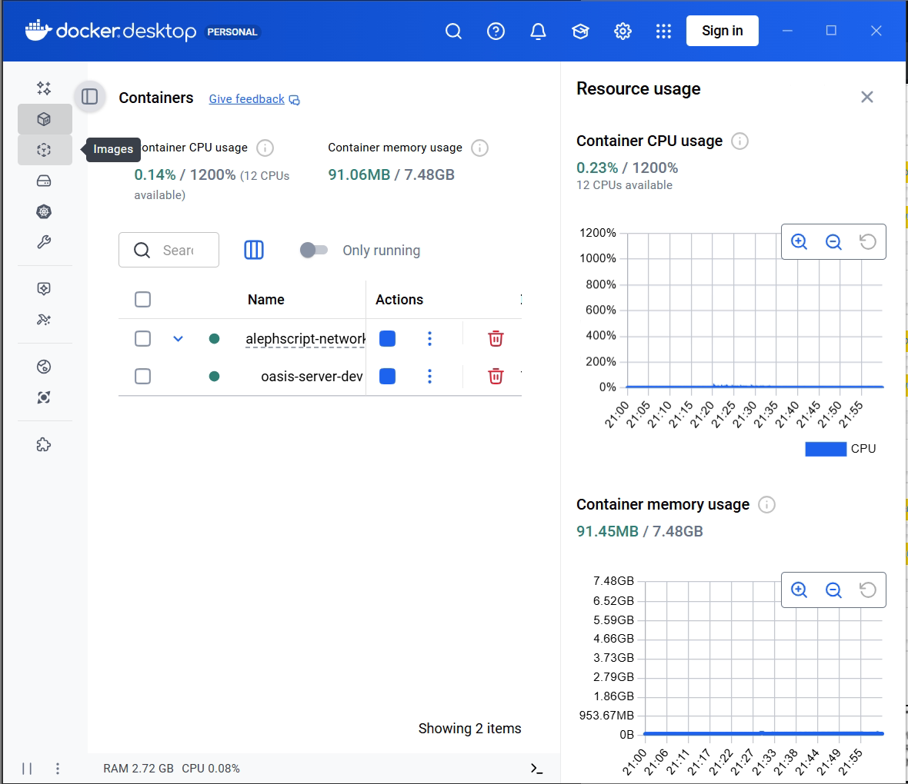
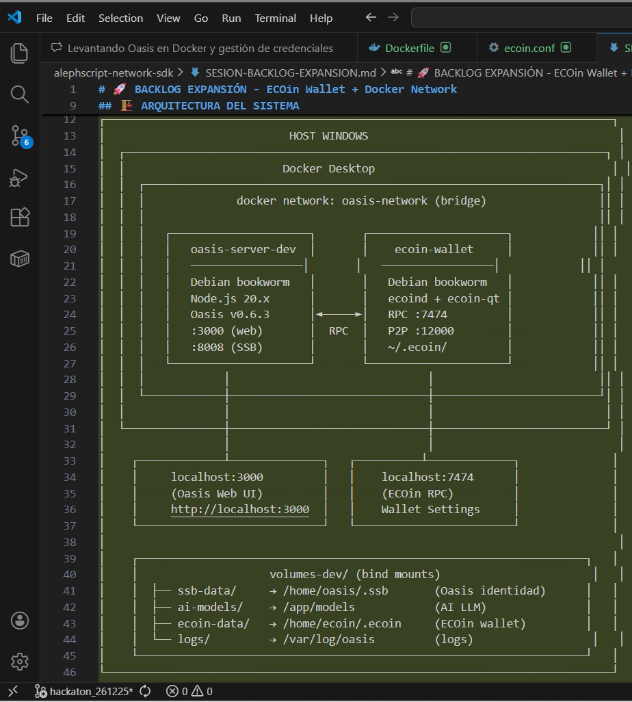

# 🐳 DockerizedOasisTutorial

[Tutorial para correr OASIS en Docker: acceso visita](https://escrivivir-co.github.io/alephscript-network-sdk/)  

> *Proyecto no oficial · Creado durante hackathon 2025*

⚠️ **DISCLAIMER**: Este es un proyecto experimental/educativo.  
- ❌ **NO** es un producto de [SolarNET.HuB](https://solarnethub.com)  
- ❌ **NO** es un producto de [OASIS](https://github.com/epsylon/oasis)  
- ❌ **NO** está completo ni probado exhaustivamente  
- ⚠️ **Úsalo bajo tu propio riesgo**


---

## 📅 El Plan: Antes y Durante

```
┌─────────────────────────────────────────────────────────────────────┐
│                                                                     │
│   🗓️  ANTES DEL HACKATHON           🚀 DURANTE EL HACKATHON        │
│   ─────────────────────              ─────────────────────          │
│                                                                     │
│   ✅ Clonas este repo               → Ya tienes OASIS corriendo    │
│   ✅ Levantas Docker                → Tu avatar listo en la red    │
│   ✅ Creas tu avatar                → Conectado al PUB             │
│   ✅ Te conectas al PUB             → Participas desde el minuto 0 │
│   ✅ Haces backup en USB            → Sin dramas de "perdí mi ID"  │
│                                                                     │
│   📖 Sigue HACKATON_GUIDE.md        🎯 A hackear se ha dicho       │
│                                                                     │
└─────────────────────────────────────────────────────────────────────┘
```

---

## 🏠 ¿Qué es OASIS?

**OASIS** es una red social distribuida basada en [SSB (Secure Scuttlebutt)](https://scuttlebutt.nz).

- 🔐 **Tu identidad es tuya** - Par de claves Ed25519, sin servidores centrales
- 🌐 **Mesh networking** - Funciona offline, sincroniza cuando hay conexión
- 🤖 **IA colectiva integrada** - Modelo "42" entrenado con contenido de la red
- 💰 **ECOin** - Criptomoneda interna + Renta Básica Universal
- ⚖️ **Gobernanza** - Parlamento y Cortes descentralizadas

> ⚠️ **Este tutorial NO es OASIS oficial** - Es un wrapper Docker experimental.

---

## 🚀 Quickstart (Docker)

```bash
# 1. Clona el repo
git clone https://github.com/AcidGambit/oasis-alephscript-network-sdk.git
cd oasis-alephscript-network-sdk

# 2. Prepara volúmenes
mkdir -p volumes-dev/{ssb-data,ai-models,logs}

# 3. Build + Run
docker compose up --build -d

# 4. Accede
open http://localhost:3000
```

**Requisitos**: Docker 24+, 8GB RAM mínimo. GPU NVIDIA opcional.

---

## 📚 Documentación

| Documento | Descripción |
|-----------|-------------|
| [HACKATON_GUIDE.md](HACKATON_GUIDE.md) | 💬 Conversación completa con Agente IA |
| [SESION-BACKLOG.md](SESION-BACKLOG.md) | ✅ Backlog de tareas completadas |
| [SESION-BACKLOG-EXPANSION.md](SESION-BACKLOG-EXPANSION.md) | ⚡ Expansión: ECOin wallet en Docker |
| [docs/](docs/index.html) | 🌐 Landing page para GitHub Pages |
| [GPU_SIMPLE.md](GPU_SIMPLE.md) | 🎮 Configuración de GPU para IA local |

---

## ⚠️ BACKUP: No lo olvides

Tu identidad es un archivo llamado `secret`. **Si lo pierdes, pierdes tu avatar para siempre.**

```bash
# Ubicación en tu máquina (con volúmenes Docker)
./volumes-dev/ssb-data/secret

# COPIA A USB EXTERNO ← HAZLO
cp ./volumes-dev/ssb-data/secret /media/TU_USB/oasis-backup/
```

---

## 🔗 Enlaces al Proyecto Original

Este tutorial dockeriza el proyecto OASIS de SolarNET.HuB:

- 🏠 **OASIS oficial**: [solarnethub.com](https://solarnethub.com)
- 📖 **Wiki**: [wiki.solarnethub.com](https://wiki.solarnethub.com)
- 💻 **Código fuente**: [github.com/epsylon/oasis](https://github.com/epsylon/oasis)
- 💰 **ECOin**: [ecoin.03c8.net](https://ecoin.03c8.net)

---

## 🎭 Para Freaks, Groupies y Satélites

⚠️ **IMPORTANTE**: Este repositorio es un **proyecto amateur NO OFICIAL**.

Creado con la intención de:

1. **Documentar** el proceso de preparación para un hackathon
2. **Facilitar** la entrada a nuevos habitantes de la red
3. **Experimentar** con agentes IA guiando el proceso

*¿Eres un freak de la descentralización? ¿Un groupie del SSB?*

**Bienvenido/a.** Pero recuerda: esto es experimental y puede fallar.

---

## 📸 Galería del Proceso

| Setup en VS Code | Docker Desktop | Docker Compose |
|------------------|----------------|----------------|
|  |  |  |

---

## 📜 Licencia

**[Animus Iocandi Public License (AIPL) v1.0](LICENSE)** - *"intención de bromear"*

Este repositorio es un proyecto amateur/experimental sin garantía alguna.

El código de OASIS pertenece a sus creadores en [SolarNET.HuB](https://solarnethub.com) bajo GNU AGPL v3.

> *"Si algo de aquí te sirve, genial. Si se rompe, no nos culpes."*

---

## 🔧 RESTART vs BUILD

### 📋 **RESTART** (`docker-compose restart`)

- ✅ Cambios en código fuente (`.js`, `.mjs`)
- ✅ Cambios en variables de entorno
- ✅ Cambios en configuración

### 🏗️ **BUILD** (`docker compose build`)

- ✅ Cambios en el Dockerfile
- ✅ Cambios en dependencias (nuevos paquetes)
- ✅ Primera vez que construyes

---

<details>
<summary>📋 README Original de OASIS (click para expandir)</summary>

## Oasis

Oasis is a **libre, open-source, encrypted, peer-to-peer, distributed & federated** project networking application.

### Modules incluidos:
- Agenda, AI, Audios, Banking, BlockExplorer, Bookmarks, Cipher
- Courts, Documents, Events, Favorites, Feed, Forums, Governance
- Images, Invites, Jobs, Legacy, Latest, Market, Multiverse
- Opinions, Parliament, Pixelia, Projects, Popular, Reports
- Summaries, Tags, Tasks, Threads, Topics, Transfers
- Trending, Tribes, Videos, Wallet

### Links oficiales:
- Website: https://solarnethub.com
- Documentation: https://wiki.solarnethub.com
- Code of Conduct: https://wiki.solarnethub.com/docs/code_of_conduct

</details>

---

```
  ╔═══════════════════════════════════════════════════════════╗
  ║                                                           ║
  ║   Hecho con 🤖 + ☕ durante el Hackathon 2025             ║
  ║                                                           ║
  ║   ⚠️ PROYECTO AMATEUR - NO OFICIAL - SIN GARANTÍA         ║
  ║                                                           ║
  ╚═══════════════════════════════════════════════════════════╝
```

*¿Preguntas? Este proyecto no tiene soporte oficial.*
